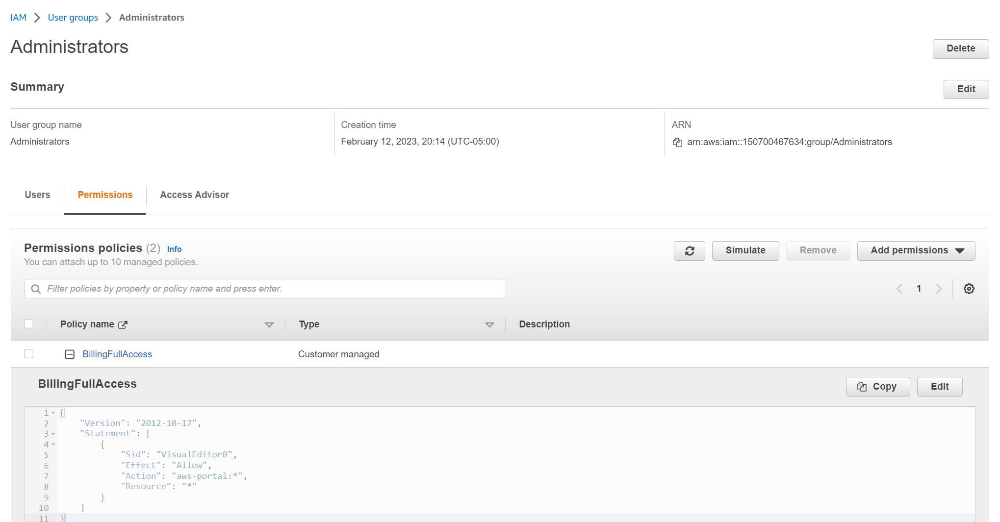
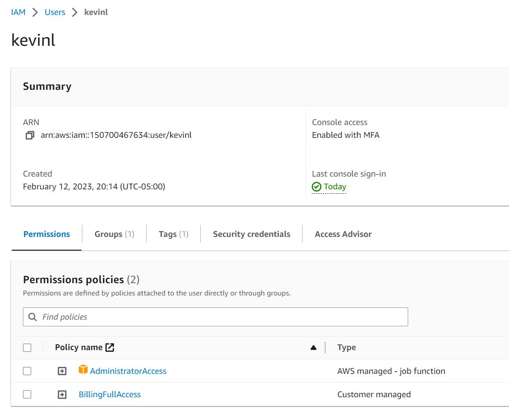
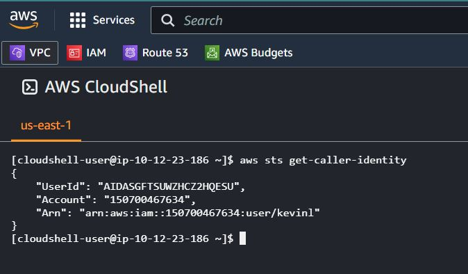
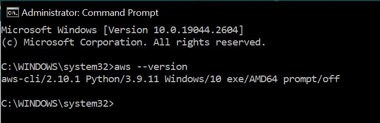
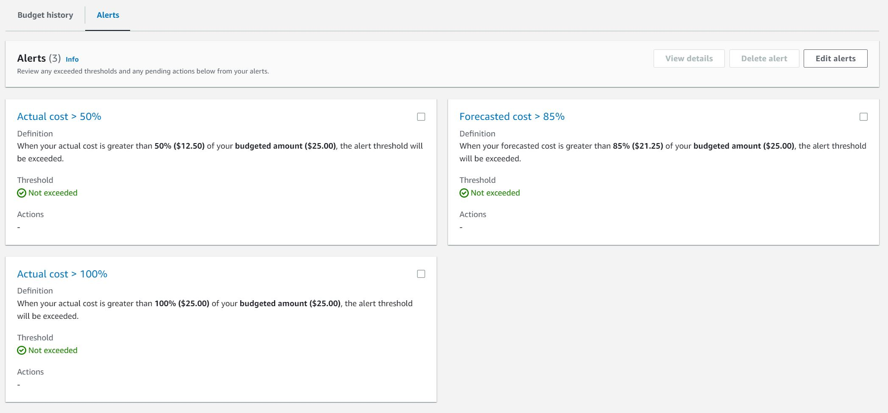
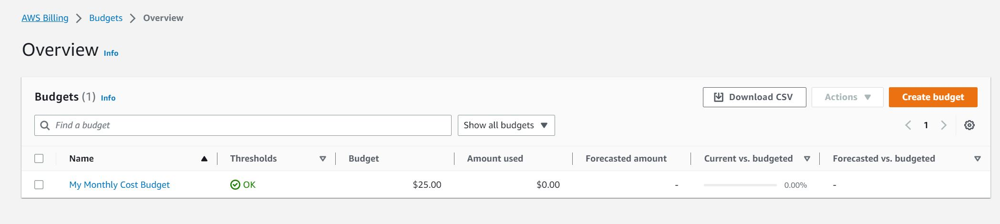
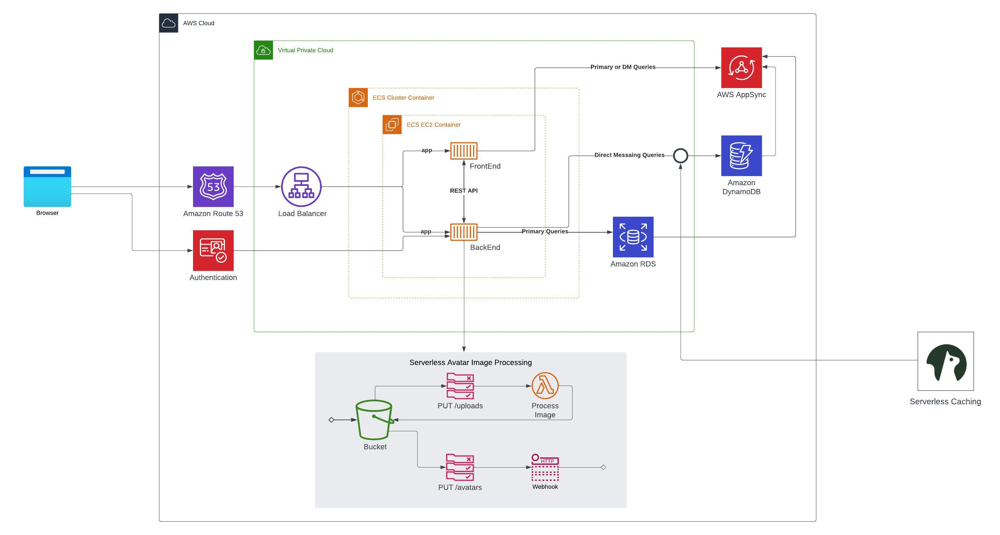

# Week 0 — Billing and Architecture


## Create AWS Admin User and Generate AWS Credentials
Created IAM user from root account
Enabled MFA on user account
Allowed Billing access for IAM users and provisioned requisite IAM policies against the user so that the IAM user can see billing portal



## Use Cloudshell
Started cloud shell in Canada Central region.
Ran standard aws cli commands as shown in yt videos
</br>
```aws account get-contact-information ```
</br>
```aws sts get-caller-identity```
</br>
Cloud Shell example run <br>


## Installed AWS CLI locally
Proof of installation of AWS on CLI </br>


## Create Billing Alarm
Proof of multiple billing alarm thresholds </br>


## Create a Budget
Proof of budget created in AWS console</br>


## Lucid Chart Diagram
Recreated detailed design, had to look up what the icon for serverless caching was </br>
[Link to LucidChart](https://lucid.app/lucidchart/f508e9b4-a998-45b0-b667-f2fddafaf9b2/edit?viewport_loc=-610%2C-1842%2C3916%2C1679%2C0_0&invitationId=inv_0103347d-1d76-4315-abfa-4e2e8916e06c)

